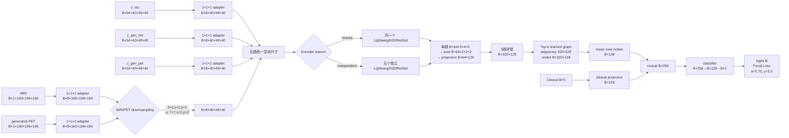

# 报告 1：NACC ResNet + Focal Loss 实验报告

**报告索引：** 1

**日期：** 2026-09-03
**数据集：** NACC
**Seed：** 2026
**模型：** 本地 3D ResNet-18，MRI + generated PET + clinical features
**结果来源：** `Gmamba/runs/nacc_resnet_focal_seed2026/`

## 1. 实验目的

此前 NACC ResNet/CNN baseline 的阈值预测出现明显同质化，部分运行在 test 集预测全部为阴性。此次实验同时处理两个可能原因：移除选定 cohort 中无信息的 `NACCMMSE`，并使用 Focal Loss 强化少数类和难例的训练信号。

## 2. 数据与输入

保持已确认的 subject-level split：train=174、val=45、test=57；类别计数分别为 train 141/33、val 36/9、test 47/10（negative/positive）。输入临床变量为：

- `CDRSUM`
- `NACCGDS`
- `SEX`
- `AGE`

`NACCMMSE` 未进入模型。NACC 特殊编码 `-4, 88, 97, 98, 99` 对保留的数值变量先视为缺失，再用 train split 的均值填补并用 train split 的标准差标准化；验证集和测试集不参与拟合统计量。MRI 和 generated PET 使用持久化目录 `/zjs/AD_Project/NACC/gen`。

## 3. 四个 Channel-node 变体的数据流与维度变化

四个变体共享同一条数据流，差异仅在于 MRI/PET 的空间对齐方式，以及五路 source 是否共享编码器参数。本节以 NACC 的实际输入尺寸为例。

### 3.1 输入与初始通道适配

五路输入为：

```text
MRI       [B, 1, 160, 196, 160]
PET       [B, 1, 160, 196, 160]
z_rec     [B, 64, 40, 49, 40]
z_gen_mri [B, 64, 40, 49, 40]
z_gen_pet [B, 64, 40, 49, 40]
clinical  [B, 5]
```

每一路先通过独立的 `1×1×1 Conv3d` 将通道数统一为 `base_width=8`：

```text
MRI/PET：  [B, 1,  160, 196, 160] → [B, 8, 160, 196, 160]
latent：   [B, 64,  40,  49,  40] → [B, 8,  40,  49,  40]
```

因此，通道适配后 MRI/PET 与 latent 的空间尺度仍不同：MRI/PET 为 `(160,196,160)`，latent 为 `(40,49,40)`。

### 3.2 AdaptiveAvgPool 变体

在两个 AdaptiveAvgPool 变体中，MRI 和 PET 使用 `AdaptiveAvgPool3d((40,49,40))`：

```text
MRI/PET [B,8,160,196,160] → [B,8,40,49,40]
latent   [B,8,40,49,40]   → [B,8,40,49,40]
```

随后，五路 source 均输入相同空间尺寸的编码器。

### 3.3 Learned CNN 变体

在两个 Learned CNN 变体中，MRI/PET 经过两次 stride=2 的 3D 卷积完成学习式降采样：

```text
[B,8,160,196,160]
  → Conv3d(8→16, stride=2) [B,16,80,98,80]
  → Conv3d(16→8, stride=2)  [B,8,40,49,40]
```

latent 三路只经过通道适配，因此最终五路仍统一为：

```text
MRI, PET, z_rec, z_gen_mri, z_gen_pet：均为 [B,8,40,49,40]
```

### 3.4 Shared 与 Independent Encoder

四个变体的编码器输入和输出尺寸相同，区别是参数是否共享：

```text
输入                           [B,8,40,49,40]
Conv3d stem, stride=2           [B,8,20,25,20]
MaxPool3d, stride=2             [B,8,10,13,10]
Residual block 1                [B,8,10,13,10]
Residual block 2, stride=2      [B,16,5,7,5]
Residual block 3                [B,16,5,7,5]
Residual block 4, stride=2      [B,64,3,4,3]
Residual block 5                [B,64,3,4,3]
AdaptiveAvgPool3d(2,2,2)        [B,64,2,2,2]
展平空间维度                    [B,64,8]
Linear(8→128)                   [B,64,128]
```

- `shared_encoder`：五路 source 使用同一个 `Lightweight3DResNet`。
- `independent_encoder`：五路 source 各使用一个独立的 `Lightweight3DResNet`。

### 3.5 Channel nodes、图传播与临床融合

五路编码结果拼接为 320 个 channel nodes：

```text
5 × [B,64,128] → [B,320,128]
```

其中 `320 = 5 个 source × 64 个 channel nodes/source`。学习式稀疏图产生 `[320,320]` 邻接矩阵，每个节点保留 `top_k=8` 条连接；图传播不改变节点张量形状：

```text
[B,320,128] → graph message passing → [B,320,128]
[B,320,128] → mean over nodes → [B,128]
```

临床分支为：

```text
clinical [B,5] → Linear(5→128) → [B,128]
```

两路融合并分类：

```text
[B,128] graph + [B,128] clinical → [B,256]
[B,256] → Linear(256→128) → Linear(128→1) → logits [B,1]
```

训练时 logits 和标签均压缩为 `[B]`，输入 C 组 Focal Loss：`alpha=0.75, gamma=3.0`；损失函数不会改变任何中间 feature 或 node 维度。

### 3.6 四个变体的统一维度摘要

```text
五路 aligned source                 [B,8,40,49,40]
        ↓
五路 encoded feature               5 × [B,64,128]
        ↓
channel graph nodes                [B,320,128]
        ↓
graph pooling                     [B,128]
        ↓
clinical projection                [B,128]
        ↓ concat
fused representation              [B,256]
        ↓
classifier logits                  [B,1]
```

四个变体真正比较的是：

1. 固定的 AdaptiveAvgPool 对齐与可学习的 Learned CNN 对齐；
2. source encoder 参数共享与参数独立。

节点数量、graph 规模、临床融合层和分类头在四个变体中保持一致。

## 4. 训练策略

四组实验使用相同的 seed、split、模型、batch size、学习率、weight decay、early stopping 设置，仅改变 Focal Loss 参数：

- A：`alpha=0.50, gamma=1.0`
- B：`alpha=0.65, gamma=2.0`
- C：`alpha=0.75, gamma=3.0`
- D：`alpha=0.85, gamma=4.0`

Focal Loss 以 logits 计算，`alpha` 是正类权重，`gamma` 控制易分类样本的抑制。最佳 checkpoint 依据 validation AUC 选择；test 集未用于参数选择。

## 5. 结果（按数据集整合）

为便于比较，先按数据集汇总本报告涉及的 ADNI 与 NACC 结果；后续各节仍保留实验方法和原有分析文字。指标列统一为 Test AUC、ACC、BACC、F1、MCC；`pred+` 表示测试集预测为阳性的样本数。

### 5.1 ADNI 实验结果

| 实验 | 配置 | Test AUC | ACC | BACC | F1 | MCC | pred+ | N |
|---|---|---:|---:|---:|---:|---:|---:|---:|
| 7×7 Learned CNN | shared encoder | 0.8494 | 0.7419 | 0.7778 | 0.7395 | 0.5864 | 42 | 62 |
| 7×7 Learned CNN | independent encoder | 0.8825 | 0.8387 | 0.8558 | 0.8385 | 0.7055 | 34 | 62 |

### 5.2 NACC 实验结果

| 实验 | 配置 | Test AUC | ACC | BACC | F1 | MCC | pred+ | N |
|---|---|---:|---:|---:|---:|---:|---:|---:|
| ResNet + focal | A (`α=0.50, γ=1.0`) | 0.7426 | 0.8070 | 0.5287 | 0.5225 | 0.0978 | 3 | 57 |
| ResNet + focal | B (`α=0.65, γ=2.0`) | 0.6617 | 0.7544 | 0.6543 | 0.6306 | 0.2726 | 14 | 57 |
| ResNet + focal | C (`α=0.75, γ=3.0`) | 0.7745 | 0.8596 | 0.7574 | 0.7574 | 0.5149 | 10 | 57 |
| ResNet + focal | D (`α=0.85, γ=4.0`) | 0.7043 | 0.8070 | 0.6468 | 0.6526 | 0.3063 | 9 | 57 |
| 六个基线 + focal | CNN / GCN / SGCN / IBGNN / MADFormer / ITCFN | 0.6191–0.8234 | — | 0.6500–0.7074 | 0.6621–0.7158 | 0.3275–0.5110 | 3–12 | 57 |
| Channel-node + focal | AdaptiveAvgPool / Learned CNN × shared / independent | 0.7000–0.7787 | 0.8246–0.8772 | 0.5000–0.6787 | 0.4519–0.7092 | 0.0000–0.5110 | 0–6 | 57 |
| 7×7 Learned CNN + focal | shared / independent | 0.7404 / 0.7787 | 0.7895 / 0.8246 | 0.6755 / 0.5394 | 0.6621 / 0.5343 | 0.3275 / 0.1627 | 12 / 2 | 57 |

## 5.3 NACC ResNet + Focal Loss 详细结果

| 组别 | 最佳 epoch | Val AUC | Test AUC | Test ACC | Test BACC | Test F1 | Test MCC | Test confusion matrix | Test predicted positive |
|---|---:|---:|---:|---:|---:|---:|---:|---|---:|
| A | 2 | 0.8873 | 0.7426 | 0.8070 | 0.5287 | 0.5225 | 0.0978 | `[[45,2],[9,1]]` | 3 |
| B | 4 | 0.8735 | 0.6617 | 0.7544 | 0.6543 | 0.6306 | 0.2726 | `[[38,9],[5,5]]` | 14 |
| C | 23 | 0.8673 | 0.7745 | 0.8596 | 0.7574 | 0.7574 | 0.5149 | `[[43,4],[4,6]]` | 10 |
| D | 4 | 0.8704 | 0.7043 | 0.8070 | 0.6468 | 0.6526 | 0.3063 | `[[42,5],[6,4]]` | 9 |

## 6. C 组参数下的六个基线复跑

在完成 ResNet 的四组参数选择后，使用最终选定的 C 组参数（`alpha=0.75, gamma=3.0`）对其余六个基线方法进行独立串行复跑。为避免 GPU 资源争用，六个任务依次使用 GPU 0 执行；ResNet 不重复运行。

| 方法 | 最佳 epoch | Val AUC | Test AUC | Test ACC | Test BACC | Test Recall | Test PRE | Test F1 | Test MCC | Test confusion matrix | Test predicted positive |
|---|---:|---:|---:|---:|---:|---:|---:|---:|---:|---|---:|
| CNN | 6 | 0.8827 | 0.7213 | 0.7895 | 0.6755 | 0.6755 | 0.6528 | 0.6621 | 0.3275 | `[[40,7],[5,5]]` | 12 |
| GCN | 16 | 0.8673 | 0.6681 | 0.8421 | 0.7074 | 0.7074 | 0.7257 | 0.7158 | 0.4328 | `[[43,4],[5,5]]` | 9 |
| SGCN | 31 | 0.8426 | 0.6191 | 0.8421 | 0.7074 | 0.7074 | 0.7257 | 0.7158 | 0.4328 | `[[43,4],[5,5]]` | 9 |
| IBGNN | 28 | 0.8241 | 0.6596 | 0.8246 | 0.6968 | 0.6968 | 0.6968 | 0.6968 | 0.3936 | `[[42,5],[5,5]]` | 10 |
| MADFormer | 26 | 0.8549 | 0.8234 | 0.8772 | 0.6500 | 0.6500 | 0.9352 | 0.6961 | 0.5110 | `[[47,0],[7,3]]` | 3 |
| ITCFN | 5 | 0.8395 | 0.7957 | 0.8421 | 0.6681 | 0.6681 | 0.7257 | 0.6889 | 0.3896 | `[[44,3],[6,4]]` | 7 |

六个基线中，MADFormer 的 test AUC（`0.8234`）和 MCC（`0.5110`）最高，但只预测 3 个阳性，仍表现出明显的阴性偏向。GCN 与 SGCN 的 test BACC 和 F1 均为 `0.7074` 和 `0.7158`，但 SGCN 的 test AUC 仅为 `0.6191`，低于 GCN 的 `0.6681`。ITCFN 的 test AUC 为 `0.7957`，位列六个基线第二；CNN 和 IBGNN 的 test AUC 分别为 `0.7213` 和 `0.6596`。这些结果均来自单一 seed 和固定 split，不能据此宣称某一基线具有普遍优势。

## 7. 四个 Channel-node 主实验的 C 组重测

在完成 ResNet 参数选择和六个传统基线复跑后，将最终 C 组参数（`alpha=0.75, gamma=3.0`）应用于四个 NACC Channel-node learned-edge 主实验。四组保持原主实验的数据与模型条件不变：MRI/PET `(160,196,160)` 对齐到 latent `(40,49,40)`，使用三路 latent feature、原有 clinical 输入、固定 seed=2026 和固定 subject-level split；本次仅将 BCE 换为 Focal Loss。四组采用 GPU 0 串行执行，避免资源争用。

| 配置 | 最佳 epoch | Val AUC | Test AUC | Test ACC | Test BACC | Test Recall | Test PRE | Test F1 | Test MCC | Test confusion matrix | Test predicted positive |
|---|---:|---:|---:|---:|---:|---:|---:|---:|---:|---|---:|
| AdaptiveAvgPool + shared encoder | 14 | 0.9228 | 0.7000 | 0.8246 | 0.5787 | 0.5787 | 0.6745 | 0.5929 | 0.2344 | `[[45,2],[8,2]]` | 4 |
| AdaptiveAvgPool + independent encoder | 36 | 0.9198 | 0.7255 | 0.8246 | 0.5000 | 0.5000 | 0.4123 | 0.4519 | 0.0000 | `[[47,0],[10,0]]` | 0 |
| Learned CNN + shared encoder | 9 | 0.9074 | 0.7532 | 0.8596 | 0.6787 | 0.6787 | 0.7745 | 0.7092 | 0.4430 | `[[45,2],[6,4]]` | 6 |
| Learned CNN + independent encoder | 4 | 0.8920 | 0.7787 | 0.8772 | 0.6500 | 0.6500 | 0.9352 | 0.6961 | 0.5110 | `[[47,0],[7,3]]` | 3 |

四组中 Learned CNN + independent encoder 的 test AUC 最高（`0.7787`），但其只预测 3 个阳性，仍存在阴性偏向；Learned CNN + shared encoder 的 test BACC（`0.6787`）和 F1（`0.7092`）最高，且预测阳性数为 6。AdaptiveAvgPool + independent encoder 退化为全阴性预测。由于这是单一 seed/split，以上差异应视为当前实验条件下的观察，不应直接解释为架构的稳健优劣。

与原始 BCE 结果相比，本次实验隔离了损失函数变化；不过由于 focal-loss 运行保留了原主实验的 5 个 clinical numeric features（包括 `NACCMMSE`），它不能与此前“移除 `NACCMMSE`”的 ResNet/传统基线结果直接构成单因素比较。

## 8. Learned CNN 改为 7×7 卷积的补充实验

为检验 Learned CNN 降采样器的卷积感受野影响，将原有两层 `3×3, stride=2, padding=1` 卷积统一替换为两层 `7×7, stride=2, padding=3` 卷积。每层仍保持 2 倍空间下采样，因此总下采样倍率、输出空间尺寸和后续 graph 结构均不变：

```text
MRI/PET [B,8,160,196,160]
  → Conv3d(8→16, 7×7, s=2, p=3) [B,16,80,98,80]
  → Conv3d(16→8, 7×7, s=2, p=3)  [B,8,40,49,40]
```

ADNI 和 NACC 各运行 shared/independent encoder 两种配置；统一使用 C 组 Focal Loss（`alpha=0.75, gamma=3.0`）、seed=2026、原固定 split 和原有 clinical 输入。

| 数据集 | 配置 | 最佳 epoch | Val AUC | Test AUC | Test ACC | Test BACC | Test F1 | Test MCC | Test confusion matrix | Test predicted positive |
|---|---|---:|---:|---:|---:|---:|---:|---:|---|---:|
| ADNI | 7×7 Learned CNN + shared encoder | 6 | 0.8703 | 0.8494 | 0.7419 | 0.7778 | 0.7395 | 0.5864 | `[[20,16],[0,26]]` | 42 |
| ADNI | 7×7 Learned CNN + independent encoder | 2 | 0.8949 | 0.8825 | 0.8387 | 0.8558 | 0.8385 | 0.7055 | `[[27,9],[1,25]]` | 34 |
| NACC | 7×7 Learned CNN + shared encoder | 11 | 0.8765 | 0.7404 | 0.7895 | 0.6755 | 0.6621 | 0.3275 | `[[40,7],[5,5]]` | 12 |
| NACC | 7×7 Learned CNN + independent encoder | 19 | 0.8642 | 0.7787 | 0.8246 | 0.5394 | 0.5343 | 0.1627 | `[[46,1],[9,1]]` | 2 |

### 8.1 结果分析

- ADNI 上，7×7 + independent encoder 表现最好：Test AUC=`0.8825`、BACC=`0.8558`、F1=`0.8385`、MCC=`0.7055`。
- ADNI 上，7×7 + shared encoder 也取得 Test AUC=`0.8494` 和 MCC=`0.5864`，但预测阳性数较高（42/62），假阳性为 16。
- NACC 上，7×7 + shared encoder 的 BACC=`0.6755`、F1=`0.6621`，明显优于 7×7 + independent encoder；后者仅预测 2 个阳性，预测同质化重新出现。
- NACC 两种配置的 Test AUC 分别为 `0.7404` 和 `0.7787`，但独立编码器的阈值分类指标较差，说明排序能力与固定阈值分类表现存在差异。
- 与原 3×3 Learned CNN 结果相比，7×7 卷积在 ADNI independent encoder 上的 Test AUC 从 `0.8451` 提升到 `0.8825`；NACC independent encoder 的 Test AUC 保持为 `0.7787`，但 BACC 从 `0.6500` 降至 `0.5394`。这表明扩大卷积核可能改善部分数据集上的表征或排序，却不能稳定解决 NACC 的预测同质化问题。

本实验只改变 Learned CNN 的卷积核大小，保留 stride、padding、网络层数、输出通道和其余训练条件；但结果仍来自单一 seed/split，不能据此确认 `7×7` 在总体上优于 `3×3`。

## 9. 补充数据流地图：八个 Channel-node 运行变体

本副地图的重点是说明数据如何流经模型；结果仅作为简略旁注。纳入的运行包括：

- 原始 3×3 Learned CNN：ADNI/NACC × shared/independent，共 4 个运行；
- 7×7 Learned CNN：ADNI/NACC × shared/independent，共 4 个运行。

7×7 实验只替换 MRI/PET 降采样器中的卷积核，不改变下采样倍率、目标空间尺寸、channel-node 数量、graph 结构、临床融合层或分类头。

### 9.1 总体数据流



### 9.2 八个变体的分支关系

```text
共同输入和前处理
  MRI/PET:  [B,1,160,196,160] → adapter → [B,8,160,196,160]
  latent:   [B,64,40,49,40]  → adapter → [B,8,40,49,40]
                         │
          ┌──────────────┴──────────────┐
          │                             │
   原始 3×3 Learned CNN           7×7 Learned CNN
   两层 3×3,s=2,p=1               两层 7×7,s=2,p=3
   [B,8,160,196,160]              [B,8,160,196,160]
          ↓                             ↓
   [B,8,40,49,40]                 [B,8,40,49,40]
          │                             │
    ┌─────┴─────┐                 ┌─────┴─────┐
    │           │                 │           │
  shared   independent          shared   independent
    │           │                 │           │
 ADNI/NACC  ADNI/NACC          ADNI/NACC  ADNI/NACC

每个分支随后都执行：
[B,8,40,49,40] → [B,64,3,4,3] → [B,64,2,2,2]
→ [B,64,128]；五路 → [B,320,128]
→ graph → [B,128]；clinical → [B,128]
→ fusion [B,256] → logits [B,1]
```

### 9.3 各阶段的维度不变点

- 7×7 与 3×3 的差异只存在于 MRI/PET 的降采样阶段；两者均执行两次 stride=2，因此 `(160,196,160)` 最终都变为 `(40,49,40)`。
- shared 与 independent 的差异只存在于 encoder 参数组织：前者复用一个 encoder，后者为五路 source 分别维护 encoder；每路输出维度相同。
- 五路 source 始终是 `mri、pet_gen、z_rec、z_gen_mri、z_gen_pet`，所以 node 数始终为 `5×64=320`。
- graph 的输入输出均为 `[B,320,128]`；临床分支为 `[B,5]→[B,128]`；最终融合为 `[B,256]→[B,1]`。
- Focal Loss 只接收最终 logits `[B]` 和标签 `[B]`，不参与任何空间、通道或 node 维度变换。

### 9.4 结果旁注

- 原始 3×3 Learned CNN 的 C 组重测：NACC shared Test AUC=`0.7404`，NACC independent=`0.7787`；ADNI shared=`0.8494`，ADNI independent=`0.8825`。
- 7×7 Learned CNN：ADNI independent 的 Test AUC 最高，为 `0.8825`；NACC independent 为 `0.7787`，但 BACC 降至 `0.5394`，只预测 2 个阳性。
- 7×7 NACC shared 的 BACC=`0.6755`、F1=`0.6621`，比 NACC 7×7 independent 的阈值分类表现更平衡。
- 这些旁注只用于快速定位运行结果；正式解释仍应结合单一 seed/split 的限制。

## 10. 分析

### 10.1 预测同质化明显缓解

A 组仍偏向阴性，test 仅预测 3 个阳性，和原先全阴性 baseline 接近。B 组预测 14 个阳性，C 组预测 10 个阳性，D 组预测 9 个阳性；C 组的预测阳性数与 test 的真实阳性数相同，并且 confusion matrix 显示 TP=6、FN=4，说明模型不再通过单一阴性策略获得表面 accuracy。

### 10.2 Test 综合分类结果以 C 组最好

C 组 test BACC=0.7574、F1=0.7574、MCC=0.5149，均高于 A/B/D。C 组 test AUC=0.7745，也高于 A 的 0.7426、B 的 0.6617 和 D 的 0.7043。其 test accuracy=0.8596，但结论主要依据 BACC、F1、MCC、AUC 以及 confusion matrix，而非 accuracy 单项。D 组进一步提高正类权重和难例聚焦强度后，test 指标反而低于 C 组，说明在当前固定 split 上继续增强干预并未带来收益。

### 10.3 Validation 与 test 存在排序差异

按 validation AUC，A（0.8873）高于 B（0.8735）、D（0.8704）和 C（0.8673）；但 test AUC 和阈值分类指标均由 C 组最好。这说明当前单一固定 split 的 validation AUC 对 focal 参数选择不稳定，不能把 validation 排名直接解释为泛化性能排名。C 组虽然 test 最好，但该结论仍应视为单一 seed/split 的结果，而不是稳健统计优势。

### 10.4 对 `NACCMMSE` 的解释

本实验不能把性能变化全部归因于移除 `NACCMMSE`，因为同时改变了损失函数。可确认的是：新实验明确排除了该变量，保留了 `CDRSUM` 等临床变量，并且 train-only 标准化避免了验证/测试统计泄漏。若要单独估计 `NACCMMSE` 的因果影响，还需要在相同 BCE/Focal 条件下做成对 ablation。

## 11. 结论与建议

在本次 seed=2026 固定 split 上，推荐将 C 组（`alpha=0.75, gamma=3.0`）作为最终参数选择：它同时减少预测同质化，并取得四组中最高的 test BACC、F1、MCC 和 AUC。D 组作为边界测试未超过 C 组，因此本轮参数选择结束。但不应仅依据该一次实验声称 Focal Loss 已普遍优于 baseline。

后续应优先进行多 seed 重复实验或交叉验证，并报告均值、标准差和每个 seed 的 confusion matrix；同时增加 `NACCMMSE` 保留/移除的正交 ablation，以区分临床特征清理和 Focal Loss 的独立贡献。

## 12. 可复核文件

- A：`Gmamba/runs/nacc_resnet_focal_seed2026/alpha050_gamma10/metrics.json`
- B：`Gmamba/runs/nacc_resnet_focal_seed2026/alpha065_gamma20/metrics.json`
- C：`Gmamba/runs/nacc_resnet_focal_seed2026/alpha075_gamma30/metrics.json`
- D：`Gmamba/runs/nacc_resnet_focal_seed2026/alpha085_gamma40/metrics.json`
- 每组的 `test_predictions.csv` 用于复核预测阳性数量和 confusion matrix。
- 六个基线复跑结果：`Gmamba/runs/nacc_baseline_focal_seed2026_serial/<model>/metrics.json`
- 四个 Channel-node 主实验 C 组重测：`Gmamba/runs/channel_graph_nacc_20260903_focal_c/<configuration>/metrics.json`
- 7×7 Learned CNN 补充实验：`Gmamba/runs/channel_graph_7x7_focal_c/<dataset>_learned_cnn_<encoder>/metrics.json`
